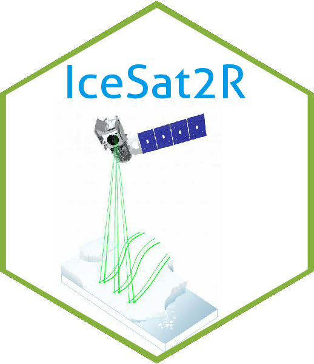
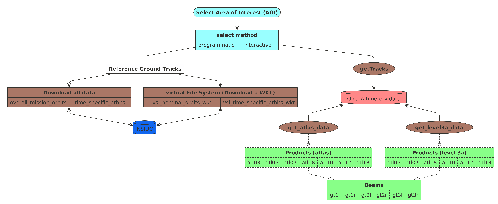
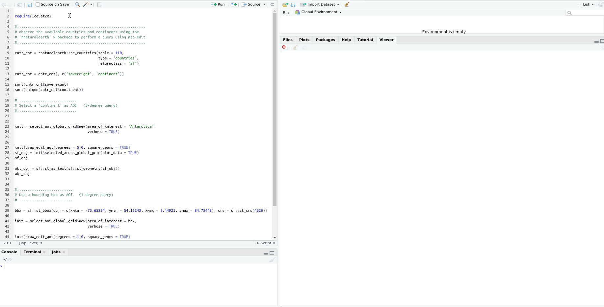
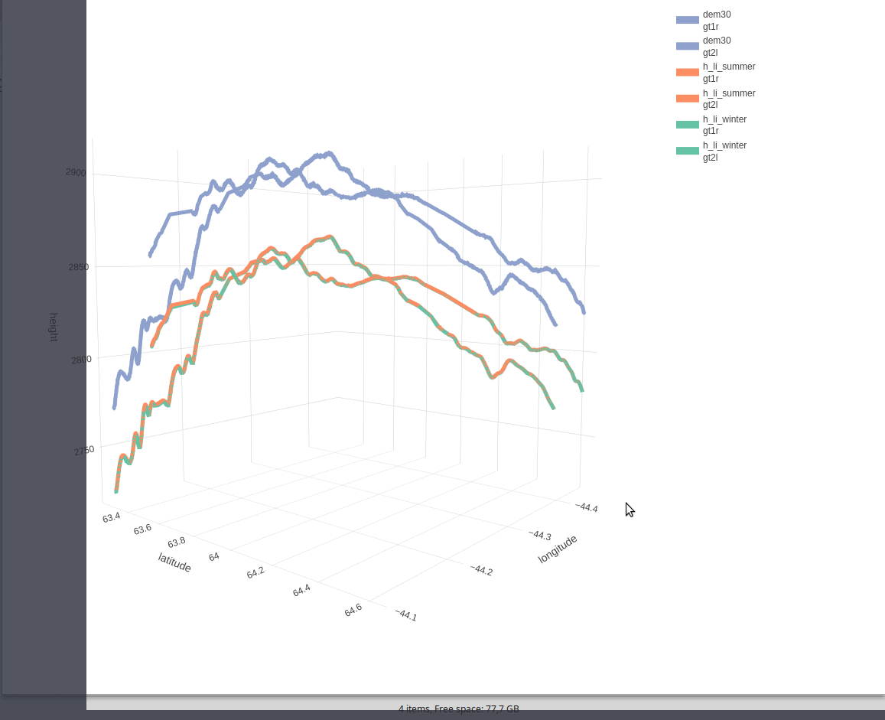
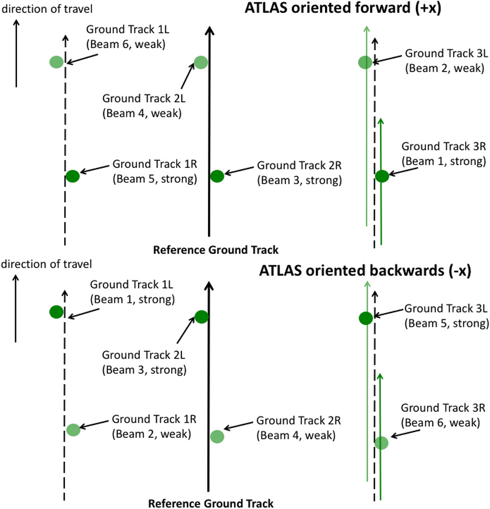

[](https://mybinder.org/v2/gh/mlampros/IceSat2R/HEAD?urlpath=rstudio)
[](https://github.com/mlampros/IceSat2R/actions)
[](https://mlampros.github.io/IceSat2R/reference/index.html)
[](http://cran.r-project.org/package=IceSat2R)
[](http://www.r-pkg.org/pkg/IceSat2R)
[](https://hub.docker.com/r/mlampros/icesat2r)
[](https://cran.r-project.org/package=IceSat2R)
[](https://codecov.io/github/mlampros/IceSat2R?branch=master)


</img>

## IceSat2R

<br>

Programmatic connection to the [OpenAltimetry API](https://openaltimetry.org/data/swagger-ui/) to download and process the following *ICESat-2 Altimeter Data*,

* *'ATL03'* (Global Geolocated Photon Data)
* *'ATL06'* (Land Ice Height)
* *'ATL07'* (Sea Ice Height)
* *'ATL08'* (Land and Vegetation Height)
* *'ATL10'* (Sea Ice Freeboard)
* *'ATL12'* (Ocean Surface Height) 
* *'ATL13'* (Inland Water Surface Height) 

The user has the option to download the data by selecting a bounding box from a 1- or 5-degree grid globally utilizing a shiny application. The [Documentation](https://mlampros.github.io/IceSat2R/reference/index.html), the two package Vignettes ([first](https://mlampros.github.io/IceSat2R/articles/IceSat-2_Mission_Orbits_HTML.html), [second](https://mlampros.github.io/IceSat2R/articles/IceSat-2_Atlas_products_HTML.html)) and the [blog post](http://mlampros.github.io/2022/02/12/IceSat2R_Altimetry_data/) explain the functionality in detail.

<br>

The ICESat-2 mission collects altimetry data of the Earth's surface. The sole instrument on ICESat-2 is the Advanced Topographic Laser Altimeter System (ATLAS) instrument that measures ice sheet elevation change and sea ice thickness, while also generating an estimate of global vegetation biomass. 

ICESat-2 continues the important observations of 

* *ice-sheet elevation change*
* *sea-ice freeboard*, and 
* *vegetation canopy height* 

begun by ICESat in 2003.

<br>

#### **System Requirements**

The usage of the *IceSat2R* package requires a geospatial setup as specified in the [sf](https://github.com/r-spatial/sf#installing) or [terra](https://github.com/rspatial/terra#from-source-code) README.md files.

<br>

#### **How the IceSat2R package can be used?**

<br>

The *IceSat2R* package includes the code, documentation, and examples so that,

* A user can select an area of interest (AOI) either programmatically or interactively
* If the Reference Ground Track (RGT) is not known, the user has the option to utilize either
  + one of the "overall_mission_orbits()" or "time_specific_orbits()" to compute the RGT(s) for a pre-specified global area or for a time period, or
  + one of the "vsi_nominal_orbits_wkt()" or "vsi_time_specific_orbits_wkt()" to compute the RGT(s) for a specific AOI
* Once the RGT is computed it can be verified with the "getTracks()" function of the OpenAltimetry Web API
* Finally the user can utilize one of the "get_atlas_data()" or "get_level3a_data()" functions to retrieve the data for specific product(s), Date(s) and Beam(s)

This work-flow is illustrated also in the following diagram,

<br>

</img>

<br>

### Shiny application to select an area of interest (AOI) from a 1- or 5-degree global grid

<br>

The [OpenAltimetry API](https://openaltimetry.org/data/swagger-ui/) restricts the requests to a *1x1* or *5x5* degree spatial bounding box, unless the *"sampling"* parameter is set to *TRUE*. The shiny application of the *IceSat2R* package allows the user to create a spatial grid of an AOI, preferably a 1- or 5-degree grid so that the selection can be within limits. An alternative would be to create a grid of smaller grid cells than required (for instance a 4-degree grid) and then to select multiple grid cells,

<br>

</img>

<br>

### **Example Use Case-1**: 3-Dimensional Line Plot by combining ICESat-2 and Copernicus DEM (Digital Elevation Model) Data

<br>

The following 3-dimensional interactive line plot (which appears in the ['IceSat-2_Atlas_products' Vignette](https://mlampros.github.io/IceSat2R/articles/IceSat-2_Atlas_products_HTML.html)) shows,

* in *blue* color the *elevation* based on the *DEM* compared to the two ICESat-2 beams ('gt1r' and 'gt2l'), as these are separated by a 3-km distance
* in *orange* color the land-ice-height measurements of the *summer* period (separately for 'gt1r' and 'gt2l')
* in *green* color the land-ice-height measurements of the *winter* period (separately for 'gt1r' and 'gt2l')

<br>

</img>

<br>

### **Example Use Case-2**: Multi-Plot displaying the Ice, Land, Canopy and Copernicus DEM (30-meter) of each beam separately for a specific ICESat-2 Track and area of interest (Himalayas mountain range)

<br>

</img>

<br>

#### **Binder**

The user of the **IceSat2R** R package can reproduce the examples of the documentation using the available [binder Rstudio image](https://mybinder.org/v2/gh/mlampros/IceSat2R/HEAD?urlpath=rstudio). Once launched the cloud instance will take a few minutes to be ready. You can read more [about binder on the web](https://mybinder.org/). In short, binder allows to make "your code immediately reproducible by anyone, anywhere". Limitations:

* up to [maximum 100 concurrent users](https://mybinder.readthedocs.io/en/latest/about/user-guidelines.html#maximum-concurrent-users-for-a-repository)
* [1 CPU](https://discourse.jupyter.org/t/mybinder-and-multiprocessing/3238/2)
* [1 to 2 GB of memory](https://mybinder.readthedocs.io/en/latest/about/user-guidelines.html#how-much-memory-am-i-given-when-using-binder)
* [up to six hours of session time per user session](https://mybinder.readthedocs.io/en/latest/about/user-guidelines.html#how-long-will-my-binder-session-last), or up to one cpu-hour for more computationally intensive sessions

<br>

#### **Docker Image**

<br>

**Docker images** of the *IceSat2R* package are available to download from my [dockerhub](https://hub.docker.com/r/mlampros/icesat2r) account. The images come with *Rstudio* and the *R-development* version (latest) installed. The whole process was tested on Ubuntu 18.04. To **pull** & **run** the image do the following,

<br>

```R

docker pull mlampros/icesat2r:rstudiodev

docker run -d --name rstudio_dev -e USER=rstudio -e PASSWORD=give_here_your_password --rm -p 8787:8787 mlampros/icesat2r:rstudiodev

```

<br>

The user can also **bind** a home directory / folder to the image to use its files by specifying the **-v** command,

<br>

```R

docker run -d --name rstudio_dev -e USER=rstudio -e PASSWORD=give_here_your_password --rm -p 8787:8787 -v /home/YOUR_DIR:/home/rstudio/YOUR_DIR mlampros/icesat2r:rstudiodev


```

<br>

The **USER** defaults to *rstudio* but you have to give your **PASSWORD** of preference (see [www.rocker-project.org](https://www.rocker-project.org/) for more information).

<br>

Open your web-browser and depending where the docker image was *build / run* give, 

<br>

**1st. Option** on your personal computer,

<br>

```R
http://0.0.0.0:8787 

```

<br>

**2nd. Option** on a cloud instance, 

<br>

```R
http://Public DNS:8787

```

<br>

to access the Rstudio console in order to give your username and password.

<br>

### Installation:

<br>

To install the package from CRAN use, 

```R
install.packages("IceSat2R")

```
<br>

and to download the latest version of the package from Github,

```R
remotes::install_github('mlampros/IceSat2R')

```

<br>

### R package tests:

<br>

To execute the package tests (all or a specific file) use the following code snippet:

```R

# first download the latest version of the package

url_pkg = 'https://github.com/mlampros/IceSat2R/archive/refs/heads/master.zip'
temp_pkg_file = tempfile(fileext = '.zip')
print(temp_pkg_file)

download.file(url = url_pkg, destfile = temp_pkg_file, quiet = TRUE)

dir_pkg_save = dirname(temp_pkg_file)
utils::unzip(zipfile = temp_pkg_file, exdir = dir_pkg_save, junkpaths = FALSE)

# build and install the latest version of the package

require(glue)

setwd(dir_pkg_save)
system('R CMD build --compact-vignettes="gs+qpdf" --resave-data IceSat2R-master')
gz_file = which(gregexpr(pattern = "^IceSat2R+_+[0-9]+.+[0-9]+.+[0-9]+.tar.gz", text = list.files()) != -1)
system(glue::glue("R CMD INSTALL {list.files()[gz_file]}"))

# load the package

require(IceSat2R)

# run all tests

testthat::test_local(path = file.path(dirname(temp_pkg_file), 'IceSat2R-master'),
                     reporter = testthat::default_reporter())

# run a specific test file from the 'testthat' directory of the package 
# https://github.com/mlampros/IceSat2R/tree/master/tests/testthat

test_specific_file = file.path(dirname(temp_pkg_file), 
                               'IceSat2R-master', 
                               'tests', 
                               'testthat', 
                               'test-mission_orbits.R')

Sys.setenv(NOT_CRAN = "true")       # run all tests (including the ones skipped on CRAN)
testthat::test_file(path = test_specific_file, reporter = testthat::default_reporter())
Sys.unsetenv("NOT_CRAN")            # unset the previously modified environment variable

```

The previous code snippet allows a user to test if the package works as expected in any Operating System.

<br>

### The Beam Pattern

<br>

The ATLAS beam pattern on the ground changes depending on the orientation of the ICESat-2 observatory. The pattern on top (of the following Figure) corresponds to traveling in the forward (+x) orientation, while the pattern on the bottom corresponds to traveling in the backward (-x) orientation. The numbers indicate the corresponding ATLAS beam, while the L/R mapping are used on the ATL03 and higher-level data products. The two strong beams with the TEP are ATLAS beams 1 and 3 (Fig.8, Neumann et al., 2019, https://doi.org/10.1016/j.rse.2019.111325)

<br>

</img>

<br>

Using a table to map the **strong** and **weak** beams (Reference: [sliderule-python documentation](http://icesat2sliderule.org/rtd/user_guide/Background.html#icesat-2))

<br>

<center> <h1>ATLAS oriented forward (+x)</h1> </center>

| ATLAS Spot Number      | Ground track Designation     | Beam Strength      |
|:----------------------:|:----------------------------:|:------------------:|
| 1                      | gt3r                         | Strong             |
| 2                      | gt3l                         | Weak               |
| 3                      | gt2r                         | Strong             |
| 4                      | gt2l                         | Weak               |
| 5                      | gt1r                         | Strong             |
| 6                      | gt1l                         | Weak               |

<br>

<center> <h1>ATLAS oriented backwards (-x)</h1> </center>

| ATLAS Spot Number      | Ground track Designation     | Beam Strength      |
|:----------------------:|:----------------------------:|:------------------:|
| 1                      | gt3r                         | Weak               |
| 2                      | gt3l                         | Strong             |
| 3                      | gt2r                         | Weak               |
| 4                      | gt2l                         | Strong             |
| 5                      | gt1r                         | Weak               |
| 6                      | gt1l                         | Strong             |

<br>


### Citation:

<br>

If you use the code of this repository in your paper or research please cite both **IceSat2R** and the **original articles** (see CITATION) `https://CRAN.R-project.org/package=IceSat2R`:

<br>

```R
@Manual{,
  title = {{IceSat2R}: ICESat-2 Altimeter Data using R},
  author = {Lampros Mouselimis},
  year = {2022},
  note = {R package version 1.0.2},
  url = {https://CRAN.R-project.org/package=IceSat2R},
}
```

<br>

## Code of Conduct
  
  Please note that the IceSat2R project is released with a [Contributor Code of Conduct](https://github.com/mlampros/IceSat2R/blob/master/CODE_OF_CONDUCT.md). By contributing to this project, you agree to abide by its terms.


## Acknowledgment

This project received financial [support](https://www.r-consortium.org/projects) from the

<a href="https://www.r-consortium.org/all-projects/awarded-projects">

</a>

<br>
