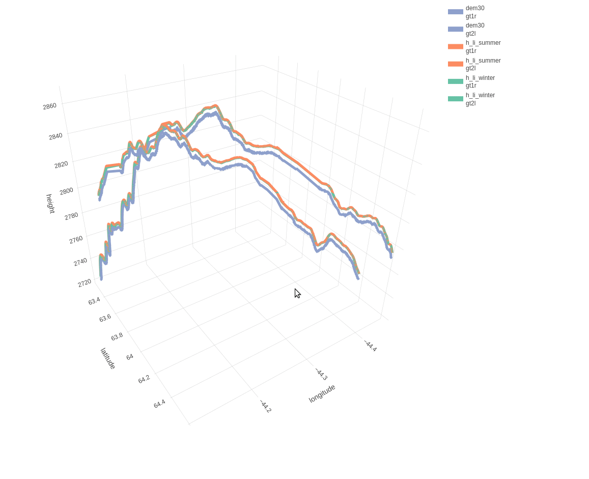

[](https://github.com/mlampros/IceSat2R/actions)
[](https://codecov.io/github/mlampros/IceSat2R?branch=master)
[](http://cran.r-project.org/package=IceSat2R)
[](http://www.r-pkg.org/pkg/IceSat2R)
[](https://hub.docker.com/r/mlampros/icesat2r)
[](https://cran.r-project.org/package=IceSat2R)


</img>

## IceSat2R

<br>

Programmatic connection to the [OpenAltimetry API](https://openaltimetry.org/data/swagger-ui/) to download and process the following *ICESat-2 Altimeter Data*,

* *'ATL03'* (Global Geolocated Photon Data)
* *'ATL06'* (Land Ice Height)
* *'ATL07'* (Sea Ice Height)
* *'ATL08'* (Land and Vegetation Height)
* *'ATL10'* (Sea Ice Freeboard)
* *'ATL12'* (Ocean Surface Height) 
* *'ATL13'* (Inland Water Surface Height) 

The user has the option to download the data by selecting a bounding box from a 1- or 5-degree grid globally utilizing a shiny application. 

The ICESat-2 mission collects altimetry data of the Earth's surface. The sole instrument on ICESat-2 is the Advanced Topographic Laser Altimeter System (ATLAS) instrument that measures ice sheet elevation change and sea ice thickness, while also generating an estimate of global vegetation biomass. 

ICESat-2 continues the important observations of 

* *ice-sheet elevation change*
* *sea-ice freeboard*, and 
* *vegetation canopy height* 

begun by ICESat in 2003.

<br>

**System Requirements**:

The usage of the *IceSat2R* package requires a geospatial setup as specified in the [sf](https://github.com/r-spatial/sf#installing) or [terra](https://github.com/rspatial/terra#from-source-code) README.md files.

<br>

### 3-Dimensional Line Plot by combining IceSat-2 and Copernicus DEM (Digital Elevation Model) Data

<br>

The following 3-dimensional interactive line plot (which appears in the *'IceSat-2_Atlas_products'* Vignette) shows,

* in *blue* color the *elevation* based on the *DEM* for the two ICESat-2 beams ('gt1r' and 'gt2l'), as these are separated by a 3-km distance
* in *orange* color the land-ice-height measurements of the *summer* period (separately for 'gt1r' and 'gt2l')
* in *green* color the land-ice-height measurements of the *winter* period (separately for 'gt1r' and 'gt2l')

<br>

</img>

<br>

To install the package from CRAN use, 

```R
install.packages("IceSat2R")

```
<br>

and to download the latest version of the package from Github,

```R
remotes::install_github('mlampros/IceSat2R')

```

<br>

### Citation:

<br>

If you use the code of this repository in your paper or research please cite both **IceSat2R** and the **original articles** (see CITATION) `https://CRAN.R-project.org/package=IceSat2R`:

<br>

```R
@Manual{,
  title = {{IceSat2R}: ICESat-2 Altimeter Data using R},
  author = {Lampros Mouselimis},
  year = {2022},
  note = {R package version 1.0.0},
  url = {https://CRAN.R-project.org/package=IceSat2R},
}
```

<br>

## Code of Conduct
  
  Please note that the IceSat2R project is released with a [Contributor Code of Conduct](https://contributor-covenant.org/version/2/0/CODE_OF_CONDUCT.html). By contributing to this project, you agree to abide by its terms.


## Acknowledgment

This project received financial [support](https://www.r-consortium.org/projects) from the

<a href="https://www.r-consortium.org/projects/awarded-projects">

</a>

<br>
