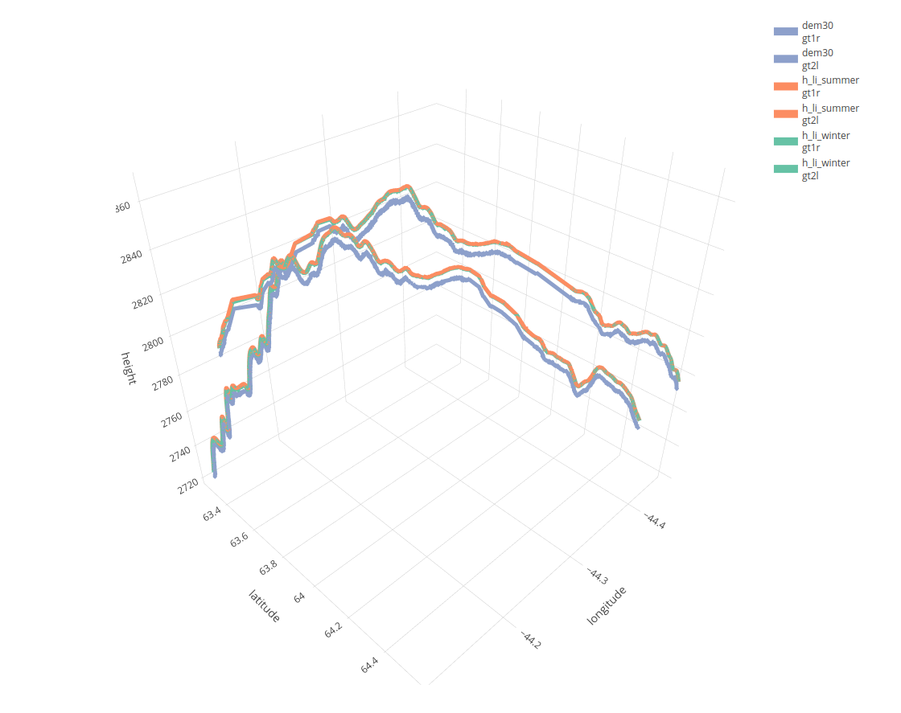

```{r setup, include=FALSE}
knitr::opts_chunk$set(echo = TRUE,
                      fig.pos = 'H')
```

### Intro to ICESat-2

The ICESat-2 mission collects altimetry data of the Earth’s surface. ICESat-2 measures the height of a changing Earth, one laser pulse at a time or 10,000 laser pulses a second. The sole instrument on ICESat-2 is the Advanced Topographic Laser Altimeter System (ATLAS) instrument that measures ice sheet elevation change and sea ice thickness, while also generating an estimate of global vegetation biomass. ICESat-2 continues the important observations of ice-sheet elevation change, sea-ice freeboard, and vegetation canopy height.


### bio and photo

| Bio                         | Photo                         |
|-----------------------------|-------------------------------|
| 
My name is Lampros Sp. Mouselimis. I'm a seasoned Data Analyst and Programmer with a degree in Business Administration and post-graduate training in Data Processing, Analysis, and Programming. While R is my preferred programming language, I can also work with Python and C++. As an open-source developer, you can find my work on GitHub (https://github.com/mlampros). With over a decade of experience in data processing using programming, I mainly work as a freelancer and run my own business, ([Monopteryx](https://monopteryx.netlify.app/portfolio/)), based in Greece. Outside of work, I enjoy swimming, cycling, running, and tennis. I also take care of two small agricultural fields, which are partly filled with olive trees |  | 

### Question 1: You built an R package called ICESat2R using the ICESat-2 satellite. Do you consider your ICESat2R project a success?

Normally someone would answer this question by having a look at the number of stars and number of downloads in the [Github repository](https://github.com/mlampros/IceSat2R) where I update the code of the ICESat-2 R package (as of December 2023 - two years after I implemented the code - the number of stars is 7 and the number of downloads 7252). Based on these facts I would say that it's not very popular compared to remote sensing packages of other R programming authors. 

On the other hand, if we define success then we should also consider the following points:

* **Personal and Professional achievement**: I applied for a grant to the R consortium and my application was accepted. Moreover, I was able to implement the code by following the milestone timelines. 
* **Contribution to the R users community**: I hope that the R programmers who use the IceSat2R R package are in place to process altimetry data without any issues and if any then I'll be able to resolve these by updating the code in the GitHub and CRAN repositories.

For me, the last two points can be considered a success.

### Who uses ICESat2R and what are the main benefits? Any unique benefits compared to the Python and Julia interfaces?

In my opinion, the users of the ICESat2R package can be Professionals, Researchers or R programming users in general. I assume that these users could be:

* ice scientists, ecologists, hydrologists (to name a few), who would be interested in the altimeter data to perform their research
* public authorities or military personnel, who for instance would like to process data related to high-risk events such as floods
* policy and decision makers (the ICESat-2 data can be used for instance in resource management)
* R users that would like to "get their hands dirty" with altimeter data

I am aware of the [Python](https://github.com/icesat2py/icepyx) and [Julia](https://github.com/evetion/SpaceLiDAR.jl) interfaces and to tell the truth I took a look at the code bases of the Authors before implementing the code, mainly because I wanted to find out the exact source they used to download the ICESat-2 data. I won't include any details about the Python or Julia code, because this is a question that should be asked the authors of these packages directly, who know the details of their code bases.

Based on the current implementation I would say that the benefits of the ICESat2R package are the following:

* The R programming users can use the [NASA's OpenAltimetry](https://openaltimetry.earthdatacloud.nasa.gov/data/) interface which as of December 2023 doesn't require any credentials
* The R package includes [3 Vignettes (Articles) and detailed documentation (Reference)](https://mlampros.github.io/IceSat2R/) for the implemented code 

### What is an interesting example of using ICESat2R?

I guess there are many examples where the ICESat2R package can be used. A potential use case would be, for instance, to display differences between a Digital Elevation Model (Copernicus DEM) and land-ice-height 'ICESat-2' measurements. The next image shows the ICESat-2 land-ice-height in winter (green) and summer (orange) compared to a DEM,

```{r icesat_2_image, echo=FALSE, fig.cap="From the package Vignette: 'ICESat-2 Atlas Products'", out.height="60%"} 



```

More detailed explanations related to this use case exist in the Vignette [ICESat-2 Atlas Products](https://mlampros.github.io/IceSat2R/articles/IceSat-2_Atlas_products_HTML.html) of the package.

### Were there any issues using OpenAltimetry API (the "cyberinfrastructure platform for discovery, access, and visualization of data from NASA's ICESat-2 mission")? (NOTE: Currently, the OpenAltimetry API website appears to be down?)

At the beginning of October 2023, I [was informed](https://github.com/mlampros/IceSat2R/issues/13) that the OpenAltimetry website (previously https://openaltimetry.org/) has migrated to https://openaltimetry.earthdatacloud.nasa.gov/. I then contacted the support of [National Snow & Ice Data Center](https://nsidc.org/home) which informed me about the migration of the API interface. Currently, I have an [open issue in my Github repo](https://github.com/mlampros/IceSat2R/issues/14) related to this migration. Once the OpenAltimetry API becomes functional again, I'll submit the updated version of the ICESat2R package to CRAN.

### In your blog post for the copernicusDEM package, you showed a code snippet showing how it loads files, iterates over the files, and uses a for-loop to grab all the data. Can you provide something similar for ICESat2R?

Whenever I submit an R package to CRAN I include one (or more) Vignettes that explain the functionality of the package. Once the package is accepted, I also upload one of the vignettes to my [personal blog](http://mlampros.github.io/). This was the case for the [CopernicusDEM](https://cran.r-project.org/web/packages/CopernicusDEM/index.html) R package,

* [Vignette](https://cran.r-project.org/web/packages/CopernicusDEM/vignettes/Copernicus_Digital_Elevation_Models.html)
* [Blog Post](http://mlampros.github.io/2021/05/21/copernicusDEM_package/)

but also for the [ICESat2R](https://cran.r-project.org/web/packages/IceSat2R/index.html) package,

* [Vignette 1](https://cran.r-project.org/web/packages/IceSat2R/vignettes/IceSat-2_Atlas_products_PDF.pdf)
* [Vignette 2](https://cran.r-project.org/web/packages/IceSat2R/vignettes/IceSat-2_Mission_Orbits_PDF.pdf)
* [Vignette 3](https://cran.r-project.org/web/packages/IceSat2R/vignettes/IceSat-2_Virtual_File_System_Orbits_PDF.pdf)
* [Blog Post](http://mlampros.github.io/2022/02/12/IceSat2R_Altimetry_data/)

### The current version of IceSat2R on CRAN (https://CRAN.R-project.org/package=IceSat2R) is 1.04. Are you still actively supporting IceSat2R? Are you planning to add any major features?

Yes, I still actively support IceSat2R. I always respond to issues related to the package and I also fix potential bugs or errors. The [NEWS page](https://github.com/mlampros/IceSat2R/blob/master/NEWS.md) of the package includes the updates of the package since the first upload of the code base to Github.

I don't plan to add any new features in the near future, but I'm open to pull requests in the Github repository if a user would like to include new functionality that could benefit the R programming community.

### The information here looks excellent: https://cran.r-project.org/web/packages/IceSat2R/readme/README.html  Should we link to this README? There are broken images that appear to show workflow and other pieces of information.

I would prefer that you link to the [README file of the Github repository](https://github.com/mlampros/IceSat2R/blob/master/README.md) because I first update this file and then I submit the package to CRAN. Moreover, it is feasible to display images or gif-files on Github compared to the CRAN repository.


