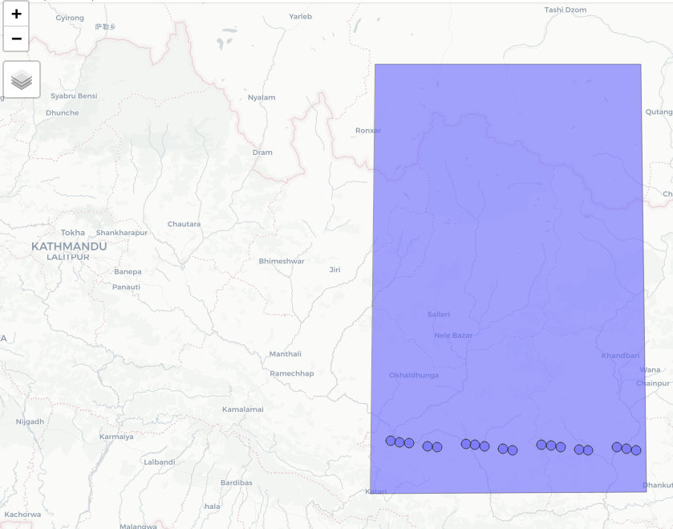

```{r, include = FALSE}
knitr::opts_chunk$set(fig.width = 4,
                      fig.height = 6, 
                      fig.align = "center",
                      fig.pos = "!H",
                      warning = FALSE, 
                      message = FALSE,
                      echo = TRUE,
                      eval = FALSE)
```

<br>

In this *third* vignette I'll make use of the [GDAL Virtual File Systems](https://gdal.org/user/virtual_file_systems.html) to download *nominal* and *time specific* orbit data (from the [ICESat-2 Technical Specs website](https://icesat-2.gsfc.nasa.gov/science/specs)) for an Area of Interest (AOI). This will allow me to reduce the download and computation time once I make the requests to the [OpenAltimetry API](https://openaltimetry.org/data/swagger-ui/). 

The area of interest is the **Himalayas mountain range** which has some of the *highest peaks* in the world, including *mount Everest*. The following map shows the bounding box area that I'll use in this vignette,

<br>

```{r himalayas-aoi, fig.pos='h', out.width = "105%", out.height = "100%", fig.align = 'center', fig.cap = "Area of Interest", fig.alt="Display the area of interest in Himalayas", echo = F, eval = T}


# mp1 = mapview::mapview(geoms_himal[2, ], legend = F)      # see next code snippet for the "geoms_himal" variable
# mp2 = mapview::mapview(geoms_himal[2, ], legend = F)
# 
# 
# leafsync::sync(mp1, mp2, ncol = 2)
```

<br>

First, we load the data,

<br>

```{r}

pkgs = c('IceSat2R', 'magrittr', 'sf', 'mapview', 'leaflet')
load_pkgs = lapply(pkgs, require, character.only = TRUE)  # load required R packages

geoms_himal_pth = system.file('data_files', 'vignette_data', 'himalayas.RDS', package = "IceSat2R")
geoms_himal = readRDS(geoms_himal_pth)
geoms_himal

# Simple feature collection with 2 features and 1 field
# Geometry type: POLYGON
# Dimension:     XY
# Bounding box:  xmin: 86.35254 ymin: 26.95635 xmax: 87.29736 ymax: 28.25842
# CRS:           EPSG:4326
#   area_size                       geometry
# 1     small POLYGON ((86.36902 27.66164...
# 2       big POLYGON ((86.35254 26.95635...

```

<br>

Since the *Himalayas mountain range* is located in the *Eastern Hemisphere* we'll pick this as an area to use as input to the *IceSat2R::vsi_nominal_orbits_wkt()* function. Moreover, we'll iterate over all *8 available repeats* for the *Eastern Hemisphere* to retrieve the *Reference Ground Tracks (RGTs)* of the AOI based on the *nominal orbits*,

<br>

```{r}

sf_wkt = sf::st_geometry(subset(geoms_himal, area_size == 'big'))

centr_wkt = sf::st_coordinates(sf::st_centroid(sf_wkt))
dat_wkt = sf::st_as_text(sf_wkt)

lst_out = list()

for (iter in 1:8) {         # iterate over all available repeats
  
  cat(paste0(iter, '.'))
  
  dat_iter = IceSat2R::vsi_nominal_orbits_wkt(orbit_area = 'eastern_hemisphere',
                                              track = 'GT7',
                                              rgt_repeat = iter,
                                              wkt_filter = dat_wkt,
                                              download_method = 'curl',
                                              download_zip = FALSE,
                                              verbose = TRUE)
  lst_out[[iter]] = dat_iter
}

# 1.The available Icesat-2 orbits will be red from 'https://icesat-2.gsfc.nasa.gov/ ... 
# Access the data of the technical specs website ...
# Extract the .zip files and the corresponding titles ...
# Keep the relevant data from the url's and titles ...
# Process the nominal and time specific orbits separately ...
# Adjust the Dates of the time specific orbits ...
# Create the nominal orbits data.table ...
# Create the time specific orbits data.table ...
# Return a single data.table ...
# .............
# 8.The available Icesat-2 orbits will be red from 'https://icesat-2.gsfc.nasa.gov/ ... 
# Access the data of the technical specs website ...
# .............
# Elapsed time: 0 hours and 0 minutes and 2 seconds. 
# Data based on repeat and track will be kept ...
# Data based on repeat and track will be kept ...
# The file 'EasternHem_repeat8_GT7.kmz' will be processed ... 
# Total Elapsed time: 0 hours and 0 minutes and 5 seconds. 

```

<br>

```{r}

lst_out = unlist(lst_out, recursive = F)
unq_rgts = as.vector(unique(unlist(lapply(lst_out, function(x) x$RGT))))
unq_rgts

 # [1] "96"   "157"  "363"  "538"  "599"  "805"  "866"  "1041" "1308" "1247"

```


<br>

```{r reference-plt-1, echo = F}
#......................................................... mapview visualization

# make the sf-objects valid
nams = names(lst_out)
lst_out = lapply(lst_out, function(x) sf::st_make_valid(x))
names(lst_out) <- nams

sf_wkt = sf::st_make_valid(sf_wkt)

# Plot the two sf-objects
RGTs = mapview::mapview(lst_out, legend = F)
AOI_wkt = mapview::mapview(sf_wkt, legend = F)

lft = RGTs + AOI_wkt

require(magrittr)

lft = lft@map %>% leaflet::setView(lng = as.numeric(centr_wkt[, 'X']),
                                   lat = as.numeric(centr_wkt[, 'Y']),
                                   zoom = 7)
lft
#.......................................................

```

<br>

For this specific use case we are interested in ICESat-2 data for a specific time period,

* from *'2020-01-01'* to *'2021-01-01'* (1-year's data)

Therefore, we'll make use of the *IceSat2R::vsi_time_specific_orbits_wkt()* function which queries all *15 ICESat-2 RGTs cycles* (as of March 2022) to come to the RGTs intersection for the specified 1-year time interval,

<br>

```{r}

date_start = '2020-01-01'
date_end = '2021-01-01'

orb_cyc_multi = IceSat2R::vsi_time_specific_orbits_wkt(date_from = date_start,
                                                       date_to = date_end,
                                                       RGTs = unq_rgts,
                                                       wkt_filter = dat_wkt,
                                                       verbose = TRUE)

# The available Icesat-2 orbits will be red from 'https://icesat-2.gsfc.nasa.gov/ ... 
# Access the data of the technical specs website ...
# Extract the .zip files and the corresponding titles ...
# Keep the relevant data from the url's and titles ...
# Process the nominal and time specific orbits separately ...
# Adjust the Dates of the time specific orbits ...
# Create the nominal orbits data.table ...
# Create the time specific orbits data.table ...
# Return a single data.table ...
# Elapsed time: 0 hours and 0 minutes and 0 seconds. 
# In total there are 5 intersected dates for which data will be processed! 
# The RGT cycles from which data will be processed are: 
#            RGT_cycle_6, RGT_cycle_7, RGT_cycle_8, RGT_cycle_9, RGT_cycle_10 
# -------------------------------------------------
# RGTs of cycle 'RGT_cycle_6' will be processed ... 
# -------------------------------------------------
# The 'sf' gdalinfo returned an empty character string! Attempt to read the url using 
#      the OS configured 'gdalinfo' function ...
# The internal type of the .zip file is 'kml' 
# The 'https://icesat-2.gsfc.nasa.gov/sites/default/files/page_files/IS2_RGTs_cycle6_...' 
#      'zip'  file includes  1387  'kml' files. 
# Elapsed time: 0 hours and 0 minutes and 8 seconds. 
# 6 out of 10 sublists were empty and will be removed!
# -------------------------------------------------
# RGTs of cycle 'RGT_cycle_7' will be processed ... 
# -------------------------------------------------
# 
# .................
# 
# -------------------------------------------------
# RGTs of cycle 'RGT_cycle_10' will be processed ... 
# -------------------------------------------------
# The 'sf' gdalinfo returned an empty character string! Attempt to read the url using th ...
#       'gdalinfo' function ...
# The internal type of the .zip file is 'kml' 
# The 'https://icesat-2.gsfc.nasa.gov/sites/default/files/page_files/IS2_RGTs_cycle10_date ... 
#       'zip'  file includes  1387  'kml' files. 
# Elapsed time: 0 hours and 0 minutes and 6 seconds. 
# 6 out of 10 sublists were empty and will be removed!
# In total 5 RGT cycles will be included in the output 'sf' object (RGT_cycle_6, RGT_cycle_7,
#      RGT_cycle_8, RGT_cycle_9, RGT_cycle_10)! 
# output of 'RGT_cycle_6' will be re-formatted ... 
# The 'description' column of the output data will be processed ...
# output of 'RGT_cycle_7' will be re-formatted ... 
# The 'description' column of the output data will be processed ...
# output of 'RGT_cycle_8' will be re-formatted ... 
# The 'description' column of the output data will be processed ...
# output of 'RGT_cycle_9' will be re-formatted ... 
# The 'description' column of the output data will be processed ...
# output of 'RGT_cycle_10' will be re-formatted ... 
# The 'description' column of the output data will be processed ...
# Total Elapsed time: 0 hours and 2 minutes and 37 seconds. 

```

<br>

The query returns 18 different Date-Time matches for our defined 1-year time period,

<br>

```{r}

orb_cyc_multi

# Simple feature collection with 18 features and 14 fields
# Geometry type: POINT
# Dimension:     XY
# Bounding box:  xmin: 86.45225 ymin: 27.09347 xmax: 87.22874 ymax: 27.11331
# CRS:           EPSG:4326
# First 10 features:
#    .... drawOrder icon  RGT           Date_time day_of_year cycle                  geometry
# 1  ....        NA <NA>   96 2020-01-02 00:37:11           2     6 POINT (86.97015 27.10272)
# 2  ....        NA <NA>  538 2020-01-30 23:13:14          30     6 POINT (87.22874 27.09347)
# 3  ....        NA <NA>  599 2020-02-03 23:04:54          34     6 POINT (86.45225 27.11331)
# 4  ....        NA <NA> 1041 2020-03-03 21:40:57          63     6  POINT (86.71086 27.1045)
# 5  ....        NA <NA>   96 2020-04-01 20:17:02          92     7 POINT (87.09815 27.08729)
# 6  ....        NA <NA>  599 2020-05-04 18:44:45         125     7 POINT (86.58026 27.09789)
# 7  ....        NA <NA> 1041 2020-06-02 17:20:48         154     7 POINT (86.83886 27.08907)
# 8  ....        NA <NA>   96 2020-07-01 15:56:55         183     8 POINT (87.00215 27.09888)
# 9  ....        NA <NA>  538 2020-07-30 14:32:58         212     8 POINT (87.26075 27.08963)
# 10 ....        NA <NA>  599 2020-08-03 14:24:38         216     8 POINT (86.48426 27.10947)


```

<br>

We'll use the *mapview* R package to visualize our AOI bounding box with the intersected time-specific RGTs,

<br>

```{r}

# make the sf-objects valid
orb_cyc_multi = sf::st_make_valid(orb_cyc_multi)
sf_wkt = sf::st_make_valid(sf_wkt)

# plot the sf-objects
orbit_cy = mapview::mapview(orb_cyc_multi, legend = F)
AOI_wkt = mapview::mapview(sf_wkt, legend = F)

lft = orbit_cy + AOI_wkt

lft = lft@map %>% leaflet::setView(lng = as.numeric(centr_wkt[, 'X']),
                                   lat = as.numeric(centr_wkt[, 'Y']),
                                   zoom = 7)
lft

```

<br>

```{r himalayas-rgts, fig.pos='h', out.width = "80%", out.height = "80%", fig.align = 'center', fig.cap = "Intersected RGTs", fig.alt="Intersected Reference Ground Tracks", echo = F, eval = T}



```

<br>

The output of *'vsi_time_specific_orbits_wkt()'* can be verified with the *OpenAltimetry's 'getTracks()'* function,

<br>

```{r}

bbx_aoi = sf::st_bbox(obj = sf_wkt)

dtbl_rgts = verify_RGTs(nsidc_rgts = orb_cyc_multi, 
                        bbx_aoi = bbx_aoi, 
                        verbose = TRUE)
dtbl_rgts

#      Date_time RGT_OpenAlt RGT_NSIDC
#  1: 2020-01-02          96        96
#  2: 2020-01-30         538       538
#  3: 2020-02-03         599       599
#  4: 2020-03-03        1041      1041
#  5: 2020-04-01          96        96
#  6: 2020-05-04         599       599
#  7: 2020-06-02        1041      1041
#  8: 2020-07-01          96        96
#  9: 2020-07-30         538       538
# 10: 2020-08-03         599       599
# 11: 2020-09-01        1041      1041
# 12: 2020-09-30          96        96
# 13: 2020-11-02         599       599
# 14: 2020-12-01        1041      1041
# 15: 2020-12-30          96        96
# 16: 2021-01-28         538       538
# 17: 2021-02-01         599       599
# 18: 2021-03-02        1041      1041


```

<br>
